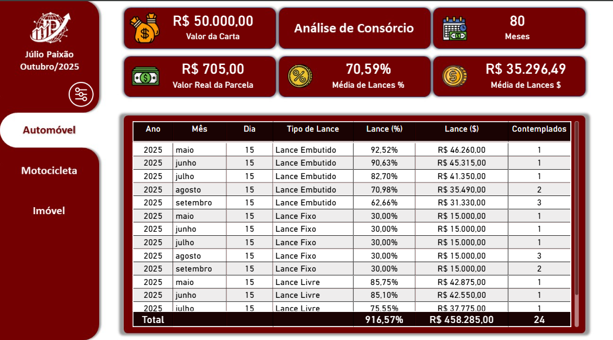

# Sistema de Análise de Grupos de Consórcio 🏦💼



## 🔗 Acesse o Dashboard Interativo

[](https://app.powerbi.com/view?r=eyJrIjoiOGFhOGNhMjUtOTY3MC00ODMyLTkzMzUtZGFiYzViYWIwMjAxIiwidCI6IjliMDFhNDdjLWQ1MjktNDBkYS05ZTI1LTYwMDNmYzgyOTc2MyN9)

**👆 Clique no badge acima para visualizar o dashboard completo e interativo!**

Dashboard interativo desenvolvido para análise e simulação de grupos de consórcio. Ferramenta que permite clientes explorarem opções de forma autônoma e vendedores utilizarem como apoio consultivo em tempo real. Baseado em experiência prática no mercado de consórcios.

---

## 🎯 Objetivo

Criar uma ferramenta comercial moderna e interativa que substitui tabelas estáticas por uma experiência visual e transparente, permitindo simulações personalizadas de consórcio com dados históricos reais.

---

## 💡 Principais Funcionalidades

### 🔍 **Histórico Real de Contemplações**
- Visualização completa do histórico de lances de cada grupo
- Percentuais reais de lances por assembleia (ex: 92,52%, 85,10%, 70,98%)
- Valores monetários e quantidade de contemplados
- **Decisão baseada em dados reais**

### 💰 **Parcela Real**
- Valor da parcela **já inclui todas as taxas**:
  - Taxa de administração embutida
  - Fundo de reserva incluído
- **O que você vê é o que você paga**

### ⚡ **Simulador Inteligente de Cenários**
- Filtros dinâmicos por Tipo de Bem (Automóvel, Motocicleta, Imóvel)
- Comparação de prazos (20M, 30M, 40M, 60M, 80M, 120M, 180M, 240M)
- Análise por tipo de lance (Livre, Embutido, Fixo)
- **Cliente explora até encontrar o encaixe perfeito**

---

## 📊 Métricas do Projeto

- **Total de Grupos:** 192 grupos estruturados
- **Registros de Lances:** 12.816 assembleias (2022-2025)
- **Categorias:** Automóveis (72) • Motocicletas (48) • Imóveis (72)
- **Faixa de Crédito:** R$ 15 mil a R$ 800 mil (Valores Base)
- **Prazos Disponíveis:** 20 a 240 meses

---

## 🛠️ Tecnologias Utilizadas

**Banco de Dados:**
- MySQL para estruturação e armazenamento
- Modelagem relacional com Foreign Keys
- 2 tabelas: `grupos` e `lances`

**Visualização:**
- Microsoft Power BI Desktop
- Power BI Service (publicação online)
- Medidas DAX para cálculos automáticos
- Filtros dinâmicos e interativos

---

## 📁 Estrutura do Projeto
```
📦 Sistema_Analise_Grupos_Consorcio
├── 📂 sql/
│   ├── 01_criacao_e_estruturacao_grupos_consorcio.sql
│   └── 02_insercao_de_dados_grupos_consorcio.sql
├── 📂 data/
│   ├── grupos_consorcio.csv (192 grupos)
│   └── lances_consorcio.csv (12.816 lances)
├── 📂 images/
│   ├── Screenshot_Dashboard_Consorcio_Automóvel.png
│   ├── Screenshot_Dashboard_Consorcio_Imóvel.png
│   └── Screenshot_Dashboard_Consorcio_Motocicleta.png
└── 📊 Dashboard_Consorcio_Power_BI.pbix
```

---

## 🚀 Como Usar

### **Power BI Online:**
- Clique no badge do Power BI acima
- Interaja com os filtros e visualizações diretamente no navegador
- Não é necessário login ou instalação

### **MySQL:**
- Baixe os arquivos SQL da pasta `sql/`
- Execute `01_criacao_e_estruturacao_grupos_consorcio.sql`
- Importe os CSVs da pasta `data/` usando MySQL Workbench

### **Power BI Desktop:**
- Baixe o arquivo `Dashboard_Consorcio_Power_BI.pbix`
- Abra no Power BI Desktop ([download gratuito](https://powerbi.microsoft.com/desktop/))
- Explore as medidas DAX e visualizações

---

## ✅ Recursos do Dashboard

✅ Filtros interativos por tipo de bem, valor e prazo  
✅ Histórico completo de lances e contemplações  
✅ Cálculo automático de parcelas com todas as taxas  
✅ Médias de lances (% e R$) por grupo  
✅ Comparativo visual de diferentes cenários  
✅ Visualização responsiva e intuitiva

---

## 👤 Desenvolvido por

**Júlio Paixão**

💼 [LinkedIn](https://www.linkedin.com/in/julio-paixao/) • 📧 [Email](mailto:paixaojulio42@gmail.com) • 🌐 [Portfolio](https://github.com/juliopaixao42)

---

Este projeto é de código aberto para fins educacionais e de portfólio.

⭐ **Se este projeto foi útil, considere deixar uma estrela!**
